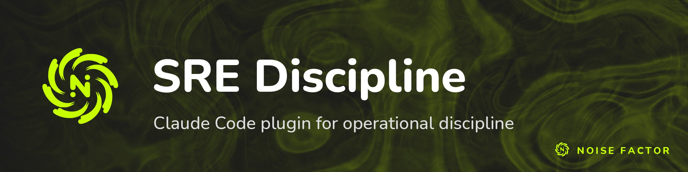

<!-- repo-hero -->
<a href="https://noisefactor.io/"></a>

<sub>Open source from <a href="https://noisefactor.io">Noise Factor</a> &middot; <a href="https://github.com/noisefactorllc">more projects</a></sub>

# SRE Discipline

*NOTE* This plugin won't keep Claude from going off the rails and blowing away production. Nothing can do that. But if you're already using Claude for prod, you've already crossed over into madness anyway. This plugin will help.

A Claude Code plugin that enforces battle-tested SRE operational discipline for infrastructure work.

When activated, it guides Claude through a rigorous checklist procedure for deployments, rollbacks, migrations, cache invalidation, certificate management, DNS changes, firewall rules, container orchestration, and incident response.

Every rule in this procedure exists because someone learned it the hard way.

## What it does

- **Classifies operations** as planned work or active incidents, with different procedures for each
- **Enforces a 5-phase checklist**: Research, Pre-flight, Execution, Short-term follow-through, Long-term follow-through
- **Loads domain-specific references** for containers, certificates, DNS, caching, firewalls, migrations, configurations, deployment pipelines, scheduled jobs, and monitoring
- **Blocks common anti-patterns**: fix cascading, commit thrashing, scope creep, premature rollback
- **Requires verification** before and after every change

## Install

```
/plugin marketplace add noisefactorllc/sre-discipline
/plugin install sre-discipline@noisefactor
```

Or require it for your team by adding to `.claude/settings.json`:

```json
{
  "extraKnownMarketplaces": {
    "noisefactor": {
      "source": {
        "source": "github",
        "repo": "noisefactorllc/sre-discipline"
      }
    }
  },
  "enabledPlugins": {
    "sre-discipline@noisefactor": true
  }
}
```

## When it activates

The skill triggers whenever Claude is performing any operation that touches:

- Docker containers or compose files
- Reverse proxies (Caddy, nginx, Traefik)
- SSL/TLS certificates or ACME
- CDN caches or static asset pipelines
- DNS records
- Firewall rules or network security
- Deployment pipelines
- Production incidents

## Reference docs

The plugin includes domain-specific reference documents that are loaded contextually:

| Reference | Covers |
|-----------|--------|
| `containers.md` | Docker traps, env var loss, network integrity, stale containers |
| `certificates.md` | ACME challenges, force-recreation cert wipe, multi-region gaps |
| `dns.md` | TTL blindness, missing AAAA records, premature record deletion |
| `caching.md` | Silent stale serving, cache key surprises, partial CDN purges |
| `firewalls.md` | ufw vs Docker iptables, DOCKER-USER chain, rule persistence |
| `migrations.md` | Shared-state sequencing, additive-first changes, backfill traps |
| `configurations.md` | Config-as-code, secret templating, drift detection, schema lint |
| `deployments.md` | What a commit triggers, what a push carries, deploys that half-apply or falsely go green |
| `scheduled-jobs.md` | Cron and timer discipline, timezone pinning, fail-closed guards, retention sweeps |
| `monitoring.md` | Hysteresis, monitor history that cannot be rebuilt, webhook coverage, maintenance windows |
| `verification.md` | Instruments that lie: masked exit codes, under-specified probes, stale negative assertions |
| `incidents.md` | Incident response procedure, anti-patterns that escalate outages |

## License

MIT
